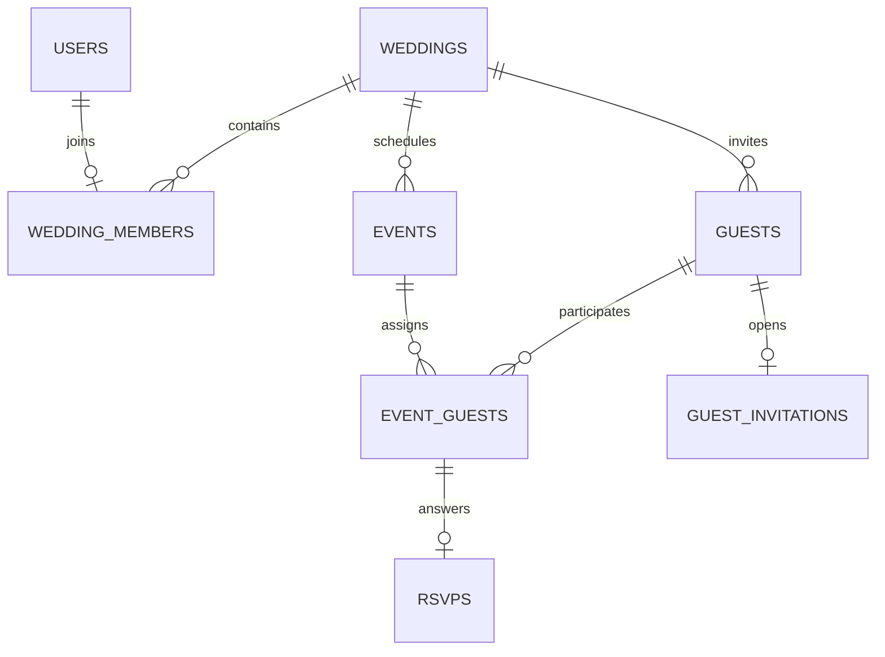

# Make My Marriage — V1 Database Design

**Status:** Implementation baseline · **Date:** 26 September 2026  
**Source:** Approved PRD V1.1 and System Design V1.1  
**Database:** MongoDB Atlas · **ODM:** Mongoose · **File bytes:** Cloudflare R2

## 1. Design rules

- Each registered account belongs to at most one *active* wedding. A wedding can have multiple admins.
- Every wedding-owned collection contains `weddingId: ObjectId`, including join collections, tokens, files, and notifications. All business queries include this scope except initial token resolution and global account lookup.
- Use ObjectId references for bounded relationships; do not embed an unbounded guest list, RSVPs, photos, or notifications inside wedding/event documents.
- Dates that represent instants use BSON Date in UTC; wedding time zone is an IANA string, for example `Asia/Kolkata`. Event local date (`YYYY-MM-DD`) and local times (`HH:mm`) are strings, with derived UTC start/end instants for sorting and reminders. A changed wedding time zone triggers recalculation of future event instants and reminder schedules.
- Money is integer paise in signed 64-bit BSON Long (`amountMinor`, currency `INR`); the application validates a nonnegative safe integer range and serializes as a decimal string at API boundaries when necessary. Never use floating-point currency or infer vendor payments from expenses.
- Every mutable document has `createdAt` and `updatedAt`. `deletedAt` or a status is used for business deactivation; do not rely on MongoDB TTL to enforce revocation because TTL deletion is asynchronous.
- All secrets and link tokens are generated with cryptographic randomness; store a SHA-256 digest of high-entropy tokens, not the raw token. The raw token appears only in the link at issuance. Exclude token hashes, password hashes, and private object keys from ordinary API projections.

## 2. Relationships

`wedding_members.userId` permits one active wedding membership per user, while `weddings` may contain two or more admins. A guest invitation belongs to a guest and a wedding, **not** to an event. Event participation is read from active `event_guests` on each public request.

## 3. Collections: identity and membership

Field notation: `!` required, `?` optional; all reference IDs are ObjectIds unless specified. Enum values are examples fixed in schema/application validation. Reject unknown write fields at the API boundary.

### `users`

| Field | Type | Rule |
| --- | --- | --- |
| `emailNormalized!` | string | Trim and lowercase; unique. Preserve `emailDisplay` if desired. |
| `passwordHash!` | string | Argon2id hash; `select: false`. |
| `name!` | string | Display name, bounded length. |
| `status!` | enum | `ACTIVE`, `DISABLED`. |
| `passwordChangedAt?` | Date | Invalidate sessions where policy requires. |

### `sessions` and `password_reset_tokens`

`sessions`: `userId!`, `sessionHash!` (unique), `expiresAt!`, `lastSeenAt!`, `revokedAt?`, timestamps. Store hash of random session cookie value, not cookie value. `password_reset_tokens`: `userId!`, `tokenHash!` (unique), `expiresAt!`, `usedAt?`, timestamps. Reset is single use with conditional update and can invalidate existing sessions. TTL may clean expired rows later; every read checks expiry and use/revocation directly.

### `weddings`

`createdBy!`, `brideName!`, `groomName!`, `weddingDate!` (local `YYYY-MM-DD`), `timeZone!`, `mainVenueName!`, `mainAddress!`, `description?`, `coverFileId?`, `status!` (`PLANNING`, `ACTIVE`, `COMPLETED`, `ARCHIVED`), `galleryTokenHash?`, `galleryTokenVersion!` (integer), `galleryTokenRotatedAt?`, timestamps. Gallery token is only required when gallery sharing is enabled. Store a hash in the wedding row so rotation atomically replaces the former link. Do not create a public wedding slug as an access credential.

For efficient public gallery resolution, use a URL containing an opaque wedding identifier plus a separate high-entropy secret. Resolve the identifier to the wedding row, compare the secret hash, then check status/version. The identifier alone grants no access. Never place a predictable wedding ID in the URL without the secret.

### `wedding_members`

`weddingId!`, `userId!`, `role!` (`ADMIN`, `MANAGER`, `MEMBER`), `status!` (`ACTIVE`, `REMOVED`), `grants!` (small enum array, V1 only `CAN_MODERATE_GALLERY` for managers), `joinedAt!`, `removedAt?`, `invitedBy?`, timestamps. The service must preserve at least one active admin. A removed account may join another wedding later under the **active membership** rule; the historical membership record stays. Rejoining the same wedding reactivates the same `(weddingId,userId)` row through a guarded update.

### `member_invites`

`weddingId!`, `emailNormalized!`, `role!`, `tokenHash!`, `expiresAt!`, `status!` (`PENDING`, `ACCEPTED`, `REVOKED`, `EXPIRED`), `invitedBy!`, `acceptedBy?`, `acceptedAt?`, `revokedAt?`, `sentAt?`, timestamps. A resend rotates the token hash and expires the previous link. Acceptance checks normalized account email, active token, expiry, and user membership constraint in one transaction. A person cannot gain a role by registering an invited email without the link.

## 4. Collections: events, guests, invitations, and RSVP

### `events`

`weddingId!`, `name!`, `type!` (`HALDI`, `MEHENDI`, `SANGEET`, `WEDDING`, `RECEPTION`, `CUSTOM`), `localDate!`, `startLocalTime!`, `endLocalTime?`, `startsAtUtc!`, `endsAtUtc?`, `venueName!`, `address!`, `mapUrl?` (HTTPS validated), `coordinates?` (`lat`,`lng` bounded, supplied rather than guessed), `description?`, `coverFileId?`, `status!` (`DRAFT`, `PUBLISHED`, `CANCELLED`), `liveStreamUrl?` (HTTPS validated), `rsvpClosedAt?`, `deletedAt?`, timestamps. An unpublished/cancelled/deleted event is not shown to guests or eligible for new RSVP. Clarify that `rsvpClosedAt` is the instant after which no guest updates are allowed; an admin can explicitly close earlier by setting it to now. Do not model an all-day event without a start time in V1.

### `guests`

`weddingId!`, `name!`, `email?`, `phone?`, `side!` (`BRIDE`, `GROOM`, `COMMON`), `relationship!` (`FAMILY`, `RELATIVE`, `FRIEND`, `COLLEAGUE`, `OTHER`), `notes?`, `status!` (`ACTIVE`, `REMOVED`), `createdBy!`, `removedAt?`, timestamps. Email/phone are optional and not unique: two guests may share a family contact. Do not expose notes/contact details on public invitation pages.

### `event_guests`

`weddingId!`, `eventId!`, `guestId!`, `status!` (`ACTIVE`, `REMOVED`), `assignedBy!`, `assignedAt!`, `removedAt?`, timestamps. Unique `(eventId,guestId)` even for removed rows; reassignment reactivates the row. Recheck both referenced records belong to `weddingId`. The application resolves current assignments from `status: ACTIVE` plus published event and active guest. A prior RSVP remains as history after removal, but never counts toward current summaries and cannot be edited through a public link.

### `guest_invitations`

`weddingId!`, `guestId!`, `tokenHash!`, `tokenVersion!`, `expiresAt!`, `status!` (`ACTIVE`, `REVOKED`), `lastSentAt?`, `lastDeliveryStatus?`, timestamps. One current row per guest; token rotation replaces the hash and increments version atomically, invalidating the old URL and QR. Guest invitation contains no event IDs. Disabling a guest invalidates their access regardless of token status. A guest-specific invitation URL and QR encode the same token.

### `rsvps`

`weddingId!`, `eventId!`, `guestId!`, `response!` (`YES`, `NO`), `attendeeCount!` (integer; YES ≥ 1, NO = 0), `respondedAt!`, timestamps. Unique `(eventId,guestId)`; public upsert only after confirming current assignment, active token, published event, and open RSVP window. Default YES attendee count limit is configurable; reject unreasonable values rather than accepting arbitrary numbers. An update overwrites the current response; optional audit history can be added later.

**Counting query:** Start from active `event_guests` for the selected published event, join the current `rsvps`, group into YES, NO, no response, and sum `attendeeCount` only for YES. `invitedGuestRecords = active event_guests`, `pending = invitedGuestRecords − accepted − declined`. Filter by `guests.side` for side-specific views. Removed guests/assignments never contribute even if an old RSVP exists.

## 5. Collections: operations and files

### `tasks`

`weddingId!`, `eventId?`, `title!`, `description?`, `assignedMemberId?` (membership row), `dueAt?`, `priority!` (`LOW`,`MEDIUM`,`HIGH`), `status!` (`TODO`,`IN_PROGRESS`,`COMPLETED`,`CANCELLED`), `createdBy!` (user), `completedAt?`, timestamps. Assignee must be an active member in the same wedding. Members may change only status of assigned tasks.

### `expenses`

`weddingId!`, `eventId!`, `title!`, `amountMinor!` (paise), `currency!` (`INR`), `category!`, `expenseDate!` (`YYYY-MM-DD` in wedding local time), `paidBy!` (text or active member reference with display snapshot), `paymentStatus!` (`UNPAID`,`PARTIAL`,`PAID`), `vendorId?`, `notes?`, `createdBy!`, timestamps. Files attach via `documents.associationType=EXPENSE` and `associationId`. The event and optional vendor must belong to the wedding. An expense is an actual record, not an overall budget.

### `vendors`

`weddingId!`, `name!`, `category!`, `contactName?`, `email?`, `phone?`, `address?`, `eventIds!` (bounded array of same-wedding event IDs), `quotedAmountMinor?`, `paidAmountMinor!` (default 0), `currency!` (`INR`), `notes?`, timestamps. `pendingAmountMinor = max(quotedAmountMinor − paidAmountMinor, 0)` when a quote exists; represent overpayment separately rather than hiding it. V1 paid amount is manually maintained and does not automatically sum linked expenses. Contracts attach as documents.

### `files`

`weddingId!`, `kind!` (`PHOTO`,`DOCUMENT`,`COVER`), `objectKey!` (unique opaque R2 key), `thumbnailKey?`, `originalName?` (display only), `declaredContentType!`, `verifiedContentType?`, `declaredSize!`, `verifiedSize?`, `checksum?`, `status!` (`PENDING`,`READY`,`FAILED`,`DELETED`), `uploadExpiresAt!`, `createdByType!` (`MEMBER`,`GUEST`), `createdById!`, `failureReason?`, timestamps. Create row before issuing a short-lived upload URL; completion confirms object metadata and content validation before `READY`. Upload completion may be retried without creating duplicate photo/document rows. Pending stale rows and orphan R2 objects are cleaned by a bounded maintenance job. Do not TTL-delete `READY` file metadata.

### `photos`

`weddingId!`, `fileId!` unique, `eventId?` (`null` = Other, if enabled), `uploadedByType!` (`MEMBER`,`GUEST`), `uploadedById!`, `invitationVersion?` for guest attribution, `status!` (`PENDING`,`APPROVED`,`REJECTED`), `caption?`, `reviewedBy?`, `reviewedAt?`, timestamps. Only approved photos backed by `files.status=READY` may receive a gallery download URL. A guest upload's identity means the invitation used, not verified physical identity.

### `documents`

`weddingId!`, `fileId!` unique, `category!`, `associationType!` (`WEDDING`,`EVENT`,`VENDOR`,`EXPENSE`), `associationId!` (wedding ID for wedding association), `uploadedBy!`, timestamps. Validate same-wedding association. Read/download requires authenticated membership and appropriate role; private document access is never granted by a gallery or guest token.

### `notifications`

`weddingId!`, `type!`, `recipientEmail!`, `recipientKind!`, `referenceType?`, `referenceId?`, `scheduledFor!`, `status!` (`QUEUED`,`CLAIMED`,`SENT`,`FAILED`,`CANCELLED`), `idempotencyKey!`, `attempts!`, `leaseUntil?`, `providerMessageId?`, `sentAt?`, `lastError?`, timestamps. Recipient address is a delivery snapshot. The scheduler atomically claims due entries with an expired/no lease, rechecks eligibility (guest assignment, event status, preferences) before send, and records success or retry. Distinguish permanent failure from retriable failure; alert admins of guest invitation failures. A unique logical idempotency key prevents duplicate reminder rows, while provider uncertainty can still yield an occasional duplicate email.

## 6. Index definitions

These are intended index specifications; create through a controlled migration/deployment step, not automatic production startup. Partial unique filters must match exactly the active statuses used in the application.

| Collection | Index keys | Options/purpose |
| --- | --- | --- |
| `users` | `{emailNormalized:1}` | unique |
| `sessions` | `{sessionHash:1}`, `{expiresAt:1}` | unique hash; TTL 0 seconds for expired rows |
| `password_reset_tokens` | `{tokenHash:1}`, `{expiresAt:1}` | unique hash; TTL cleanup, expiry checked in code |
| `wedding_members` | `{userId:1}` | unique partial `{status:"ACTIVE"}` for one active wedding/account |
| `wedding_members` | `{weddingId:1,userId:1}` | unique historical membership per pair |
| `wedding_members` | `{weddingId:1,status:1,role:1}` | admin/member listing |
| `member_invites` | `{tokenHash:1}`, `{weddingId:1,emailNormalized:1,status:1}` | unique token hash; invite listing; do not TTL-delete audit history |
| `events` | `{weddingId:1,status:1,startsAtUtc:1}` | timeline and upcoming events |
| `guests` | `{weddingId:1,status:1,side:1}` | scoped list and dashboard filter |
| `event_guests` | `{eventId:1,guestId:1}` | unique; RSVP lookup |
| `event_guests` | `{weddingId:1,guestId:1,status:1}` | invitation event list |
| `guest_invitations` | `{weddingId:1,guestId:1}`, `{tokenHash:1}` | both unique; token resolution |
| `rsvps` | `{eventId:1,guestId:1}`, `{weddingId:1,eventId:1,response:1}` | first unique; per-event summary |
| `tasks` | `{weddingId:1,status:1,dueAt:1}`, `{assignedMemberId:1,status:1}` | dashboard and my tasks |
| `expenses` | `{weddingId:1,eventId:1,expenseDate:-1}` | event totals and recent list |
| `vendors` | `{weddingId:1,name:1}` | scoped vendor list |
| `files` | `{objectKey:1}`, `{status:1,uploadExpiresAt:1}` | first unique; cleanup scan |
| `photos` | `{fileId:1}`, `{weddingId:1,status:1,createdAt:-1}` | first unique; gallery/moderation |
| `documents` | `{fileId:1}`, `{weddingId:1,associationType:1,associationId:1}` | first unique; attachment lookup |
| `notifications` | `{idempotencyKey:1}`, `{status:1,scheduledFor:1,leaseUntil:1}` | first unique; bounded claim |

No index grants authorization. For initial guest-token lookup, fetch by hash, then check state and expiry and scope all subsequent queries to its `weddingId`. Use keyset pagination on large guest/gallery lists; avoid loading full guest arrays into application memory.

## 7. Atomic writes and concurrency

| Operation | Consistency requirement |
| --- | --- |
| Create wedding | Transaction inserts wedding and creator ADMIN membership; unique active user index resolves concurrent creates. |
| Accept member invite | Transaction conditionally marks invite ACCEPTED and inserts/reactivates membership. Reject expired/revoked token and a second active wedding membership. |
| Regenerate guest or gallery token | Atomic update of hash/version/expiry; old URL ceases working immediately by application check. No permanent redirect or cached old page. |
| Assign/unassign event guest | Conditional update of join row; invitations read current assignment. If RSVP history remains, summaries filter active joins. |
| Public RSVP | Resolve active token, guest/event/assignment, open window, then unique-key upsert. For strict race handling with concurrent unassignment/close, do validation and write in a transaction or use version/conditional predicates on the assignment/event; never trust an earlier page read. |
| Finalize upload | Verify R2 object; transaction or idempotent unique-key operations mark file READY and create one photo/document. R2 itself is outside Mongo transaction; reconcile failures and orphan objects. |
| Remove last admin | Transaction checks active admin count with serialization guard/version on wedding; concurrent removals must not leave zero admins. |
| Cron claim | Atomic `findOneAndUpdate` lease on due notification. Retry only after lease expiry and backoff; claim batch is bounded. |

MongoDB transactions require a suitable Atlas cluster; keep them short and retry transient conflicts. Never call R2 or Resend while holding a MongoDB transaction. Changes that schedule/cancel email should write notification records after domain state commits or use a small outbox pattern if lost messages become a concrete issue.

## 8. Deletion, retention, and recovery

- Event cancellation or deletion hides public details, stops RSVP and reminders, and deactivates joins. Keep historical expense and RSVP records for admins unless intentionally deleted.
- Guest removal revokes invitation and excludes associated joins/responses from active summaries. Apply an explicit retention period for personal data and provide deletion behavior before production use.
- File deletion first removes references/marks metadata DELETED, then removes R2 originals and thumbnails asynchronously; retry failed cleanup. Never make a PENDING/REJECTED photo public through its object key.
- Sessions and reset tokens may expire via TTL, but explicit expiry checks remain mandatory. Keep notification outcome history for a bounded operational period; delete old logs and PII in line with the product retention policy.
- Schedule Atlas backups and test restore. R2 file objects are not covered by the MongoDB backup; document how orphan and missing objects are detected and recovered.

## 9. Validation and implementation checklist

1. Implement shared Mongoose schema conventions: `strict`, timestamps, no unrestricted population, bounded strings/arrays, and explicit API DTOs that omit secret fields.
2. Create indexes via migrations and verify partial-index behavior for active membership and historical rejoining.
3. Test same-wedding reference checks across event guests, vendors, task assignees, covers, photos, and documents.
4. Test concurrent wedding creation, invitation acceptance, last-admin removal, token rotation, RSVP versus unassignment, and duplicate upload completion.
5. Verify accepted/declined/pending and attendee sums from active joins, including a removed guest with an old YES response.
6. Verify guest token and gallery token cannot read expense attachments, pending photos, private member records, or another guest's events.
7. Choose and document configurable numerical limits (token expiry, upload size/count, RSVP attendee maximum, notification retries) before deployment.

This design is the persistence contract for V1; it does not imply that MongoDB alone enforces cross-collection foreign keys or application permissions. The service layer must enforce both.
