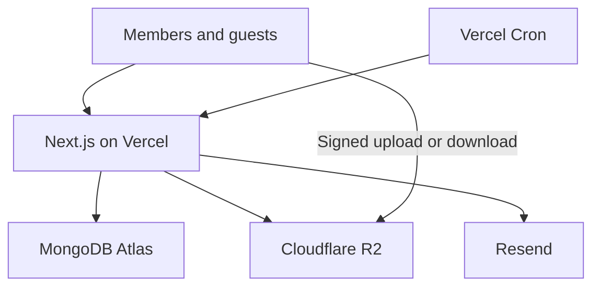

# Make My Marriage — V1.1 System Design

**Status:** Implementation baseline  
**Date:** 26 September 2026  
**Based on:** Approved `make-my-marriage-prd-v1.1-review.md`  
**Supersedes:** `make-my-marriage-system-design-v1.md`

## 1. Scope and decisions

Build one responsive Next.js application for a wedding workspace. V1 supports one wedding per registered account; two partners can each be an admin of that wedding. Guests do not sign up. A guest-specific invitation opens only assigned events and provides per-event RSVP, directions, and photo upload. QR codes encode page URLs and do not implement check-in.

| Concern | V1 decision |
| --- | --- |
| Architecture | TypeScript modular monolith in one Next.js App Router deployment on Vercel |
| Runtime and persistence | Node.js, MongoDB Atlas, Mongoose |
| Identity | Email/password for members; no signup email verification; password reset by email |
| Authorization | Central role policy plus wedding-scoped queries; guest capabilities from revocable tokens |
| Files | Private Cloudflare R2 bucket with signed, short-lived upload/download URLs |
| Email | Resend, sent by a notification module |
| Scheduling | Vercel scheduled invocation of an authenticated Next.js route handler |
| Validation and testing | Zod at boundaries; focused unit, integration, and end-to-end tests |

No payment processing, built-in streaming, map geocoding, queue service, or dedicated worker is needed for V1.

## 2. System context



Next.js hosts the responsive UI, route handlers, and business modules. MongoDB holds application data and file metadata. R2 holds media and private attachments. Resend sends email. The browser transfers large files directly to R2 only after the application authorizes the transfer.

## 3. Module and code boundaries

```text
src/app/                    UI pages, layouts, route handlers
src/modules/auth/           credentials, sessions, password reset
src/modules/weddings/       wedding profile and one-wedding rule
src/modules/members/        invitations, membership, policy
src/modules/events/         schedule, venues, directions, streams
src/modules/guests/         guest records and event assignments
src/modules/invitations/    guest links, public invitation views, QR
src/modules/rsvp/           per-event response and summaries
src/modules/tasks/          task assignment and timeline
src/modules/finance/        expenses and vendor records
src/modules/files/          upload intents, completion, file access
src/modules/gallery/        moderation and public gallery
src/modules/documents/      private attachments
src/modules/notifications/  email delivery and reminder scheduler
src/modules/dashboard/      role-filtered read models
src/lib/                    Mongo connection, R2, Resend, logging
```

Route handlers or Server Actions validate inputs, identify the actor, call a module service, and return a safe response. Services enforce authorization and business rules. Mongoose repositories always scope wedding-owned data by `weddingId`. Server Actions are subject to the same checks as route handlers; page layout visibility is not authorization.

## 4. Identity, sessions, and membership

Members register and log in with a normalized lowercase email and password. Store only a strong password hash (prefer Argon2id), never the password. Use server-managed sessions with secure, HTTP-only, SameSite cookies, session rotation after login, logout invalidation, idle/absolute expiry, and CSRF protection for cookie-authenticated mutations. Rate limit login, signup, password reset, and invitation acceptance. Reset tokens are random, single use, short lived, and stored only as hashes. Sending a reset email must not disclose whether an account exists.

V1 intentionally omits signup email verification. A member invitation is accepted **only** with an active one-time emailed link; typing or signing up with the invited email alone grants no access. Acceptance requires login/signup for the invited email and possession of the link. If the account email differs from the invitation email, block acceptance and offer a clear recovery path; possession of the link alone does not silently change an existing account's email. Admins can revoke or resend an invitation. A newly issued token invalidates the previous token.

Enforce the one-wedding-per-account rule with a unique active membership constraint on `userId`; creation of wedding plus first ADMIN membership is atomic in a MongoDB transaction. Membership acceptance is atomic with token consumption. Removal/revocation invalidates future authorized requests, and the last active admin cannot remove themselves without assigning another admin first.

## 5. Authorization policy

| Operation | Admin | Manager | Member | Guest link |
| --- | --- | --- | --- | --- |
| Wedding settings and membership | Manage | — | — | — |
| Events, guests, invitations, RSVP admin view | Manage | Manage | View relevant events | View only invited events; RSVP self |
| Tasks | Manage | Manage | View/update assigned task status | — |
| Expenses, vendors, documents, dashboard finance | Manage | Manage | — | — |
| Gallery upload | Manage | Manage | Upload | Upload with valid guest link |
| Gallery moderation | Manage | Only with explicit `CAN_MODERATE_GALLERY` grant | — | — |
| Approved gallery view | Yes | Yes | Yes | With gallery link |

Permissions are defined centrally in a typed policy. A manager cannot change member roles or remove admins. A guest token is a narrow capability, not a session or wedding membership. Always resolve the token to its wedding and guest before querying content. Verify that related `eventId`, `guestId`, `vendorId`, or file associations belong to the same wedding to prevent cross-wedding references.

## 6. Core data model

All records use `_id`, `createdAt`, and `updatedAt` unless indicated. Store money as integer minor units with currency `INR`; avoid floating-point totals. Store instants in UTC, plus an IANA wedding time zone for display. An event stores local date/time and a resolved instant to handle time-zone changes explicitly.

| Collection | Important fields and constraints |
| --- | --- |
| `users` | `emailNormalized` unique, `passwordHash`, account status. |
| `sessions` | `userId`, hashed session identifier, `expiresAt`, `revokedAt`. |
| `weddings` | names of bride/groom, `createdBy`, wedding date, main venue/address, description, cover file reference, time zone, status, gallery token hash/version. |
| `wedding_members` | `weddingId`, `userId`, role `ADMIN/MANAGER/MEMBER`, status, optional moderation grant; unique active `userId` and unique `(weddingId,userId)`. |
| `member_invites` | `weddingId`, `emailNormalized`, role, token hash, expiry, revoked/accepted time, inviter. |
| `events` | `weddingId`, name, type, date, local times, venue name, address, optional validated map URL or coordinates, description, status, cover file, external stream URL, `rsvpClosedAt`. |
| `guests` | `weddingId`, name, optional email/phone, side, relationship, notes, status. |
| `event_guests` | `weddingId`, `eventId`, `guestId`, assignment status; unique `(eventId,guestId)`. |
| `guest_invitations` | `weddingId`, `guestId` unique for active link, token hash/version, expiry, revoked time, last sent/status. **No `eventId`**: invited events come from active `event_guests`. |
| `rsvps` | `weddingId`, `eventId`, `guestId`, response YES/NO, attendee count, responded time; unique `(eventId,guestId)`. |
| `tasks` | `weddingId`, optional `eventId`, title, description, `assignedMemberId`, due instant, priority, status, creator. |
| `expenses` | `weddingId`, `eventId`, title, amount minor units, currency, category, expense date, paid by, payment status, optional vendor, notes. |
| `vendors` | `weddingId`, name/category/contact, associated event IDs, quoted and paid amounts, notes. Pending amount is calculated. |
| `files` | `weddingId`, owner kind/id, R2 key, type, size, content type, checksum if available, lifecycle `PENDING/READY/FAILED`, creator actor, upload expiry. Supports multiple expense/vendor attachments. |
| `photos` | `weddingId`, optional `eventId`, file ID, upload source `MEMBER/GUEST`, member/guest ID, moderation state `PENDING/APPROVED/REJECTED`, caption, review actor/time. |
| `documents` | `weddingId`, file ID, category, association type and ID (wedding/event/vendor/expense), creator. |
| `notifications` | `weddingId`, type, destination, reference, scheduled time, state, attempt count, idempotency key, provider ID, errors. |

Validate referenced membership and same-wedding ownership in services; Mongoose `ref` alone does not enforce this. Define deletion behavior: removing an event deactivates its guest assignments and closes RSVP access; historical records remain available to admins until explicit cleanup. Removing a guest revokes its invitation and hides it from active counts. Do not physically delete referenced files before the related records are settled.

## 7. Indexes and query patterns

Create unique indexes for `users.emailNormalized`, `wedding_members.userId` for active memberships, `(weddingId,userId)`, `guest_invitations.(weddingId,guestId)` for active links, `event_guests.(eventId,guestId)`, `rsvps.(eventId,guestId)`, and `notifications.idempotencyKey`. Index `(weddingId,date)` on events, `(weddingId,status,dueAt)` on tasks, `(weddingId,eventId)` on expenses, `(weddingId,status)` on photos, and `(state,scheduledFor)` on notifications. Index token hashes for lookup. TTL indexes may clear expired *token records* and sessions; preserve business history where needed. Check indexes against actual queries before launch.

## 8. Guest invitation, QR, and RSVP

An admin assigns active events to a guest, then creates a random high-entropy invitation token. Store its hash, place the raw token only in the emailed/copied URL, and show the URL or QR to the admin at generation time. `GET /i/[token]` resolves the token, expiry and revocation, loads current active `event_guests`, and projects only public-facing event details. It never trusts an `eventId` supplied by the browser to grant access. Search engine indexing and caching of token pages are disabled; avoid recording raw tokens in logs or analytics.

The QR is generated on demand from the **same invitation URL** and can be downloaded as an image. Regenerating the invitation token revokes old links and QR codes. An RSVP QR may point into the same invitation flow. The QR has no check-in state.

`POST /api/public/invitations/[token]/rsvps` checks the active token, current event assignment, open RSVP window, response and attendee count (`YES >= 1`, `NO = 0`), then upserts by `(eventId,guestId)`. Updates remain allowed until the admin closes responses for that event. An event removed from the invitation is excluded from the page and cannot accept further RSVP mutations. For dashboard counts, aggregate active event assignments: YES, NO, and no RSVP; `expectedAttendees = sum(attendeeCount for active YES responses)`.

Rate limit public reads/writes and do not reveal whether an arbitrary guessed token belongs to a particular guest. Guest confirmation email is sent only if an address exists and email delivery is configured; RSVP success does not depend on delivery.

## 9. Locations, directions, and external streams

Each event has its own venue name and required address. An optional HTTPS map URL or coordinates identifies the exact place; validate allowed URL schemes and normalize it. For **Get Directions**, prefer the supplied map URL; otherwise build an external map search URL by URL-encoding the stored address. A search result is not presented as an exact pin. Store the wedding's IANA time zone and render event times consistently in invitation, dashboard, QR destination, and email. An optional HTTPS live-stream URL is visible only on a currently assigned event when enabled; validate and open external URLs safely.

## 10. Gallery and file lifecycle

Keep the R2 bucket private. Never expose raw R2 object keys as a substitute for permission checks. Use keys like `weddings/{weddingId}/{kind}/{fileId}/original`; client filenames are metadata only. Separate originals and thumbnails. Public gallery pages require a high-entropy gallery token; only approved photos are returned. Admin token regeneration invalidates prior gallery links and their QR. Approved photo downloads use a short-lived signed URL issued after gallery-token validation. Bills and private documents always require membership and role checks.

Upload protocol:

1. Member session or active guest invitation requests an upload intent, including type, size, event, and claimed MIME type. Guest photos must use an event currently assigned to that guest (or `Other` if explicitly enabled). Apply per-file, per-guest, and per-wedding limits and rate limits.
2. Service creates a `PENDING` file record and issues a short-lived, object-specific R2 upload URL with required content type and size constraints as supported. The browser uploads directly to R2.
3. Browser calls completion endpoint. Server checks the object exists and validates size/type from object metadata; inspect actual content before serving, with image decoding/thumbnail generation where available. For V1, only allow supported raster image formats for gallery uploads; reject other content and clean orphaned objects.
4. Mark the file `READY` and create a `PENDING` photo record or protected document association. A retry of completion is safe. The browser sees a clear success/failure state; incomplete uploads never appear publicly.

Guest upload attribution records the invitation/guest ID used. It does not prove the physical uploader's identity if a link is forwarded. Member uploads record the member ID. Moderation services prevent a pending/rejected photo from receiving a public download URL. Thumbnail processing can run synchronously only within safe execution limits; otherwise use an on-demand or scheduled small-batch path, with original approval independent of thumbnail availability.

## 11. Member and guest access flows

```mermaid
sequenceDiagram
  participant Admin
  participant App
  participant Guest
  participant DB
  Admin->>App: Assign guest to events; send invitation
  App->>DB: Save assignment and hashed token
  App-->>Guest: Email or copied link / QR
  Guest->>App: Open guest invitation
  App->>DB: Resolve token and current event assignments
  App-->>Guest: Invited events, directions, RSVP
  Guest->>App: Submit per-event RSVP
  App->>DB: Validate assignment; upsert response
```

All guest actions revalidate token and current assignment on every request. A member's role is likewise reloaded or validated on each protected action so role changes take effect promptly.

## 12. Email and scheduled reminders

The notification service renders templates and delegates delivery to Resend. Create a notification row with a stable idempotency key such as `(type, recipient, eventId, reminderWindow)` before sending. The scheduled route accepts only the scheduler's secret/authorized invocation. Each invocation atomically claims a bounded batch of due rows with a lease; multiple invocations cannot claim the same row at once. Record sent time/provider ID or failure, retry with bounded backoff, and expose invitation delivery errors to admins. A provider timeout after acceptance may still produce a duplicate on retry; use provider idempotency support if available and design email content to tolerate duplicates. Never mark a notification sent before the provider accepts it.

Event and task reminder times are derived from wedding time zone, stored as UTC instants, and recomputed if an event or task time changes. Suppress reminders for removed assignments, revoked invitations, cancelled events, or opted-out recipients where preferences allow. Keep bulk guest sends within provider and scheduler execution limits by processing small batches per run.

## 13. Routes and rendering

| Route family | Responsibility |
| --- | --- |
| `/dashboard`, `/events`, `/guests`, `/tasks`, `/expenses`, `/vendors`, `/gallery`, `/documents`, `/settings` | Authenticated management UI; server-render summaries when useful. |
| `/api/weddings/[weddingId]/...` | Authenticated, resource-oriented mutations and reads. Validate membership and permissions. |
| `/i/[token]` and `/api/public/invitations/[token]/...` | Guest invitation, RSVP, upload intent/completion; token scoped. |
| `/g/[token]` and `/api/public/gallery/[token]/...` | Public approved-gallery read/download; gallery token scoped. |
| `/api/cron/notifications` | Scheduler-authenticated bounded batch. |

The application can use Server Actions for simple authenticated forms, but they must call the same service-layer checks as API routes. Keep client interactivity in RSVP forms, gallery upload, and QR download. Normalize URL encoding and return generic not-found responses for invalid public tokens.

## 14. Security and privacy

- Validate input with Zod at boundaries and enforce business rules in services. Protect all mutations from CSRF where cookies apply. Escape user text in email and UI; sanitize or restrict formatted content.
- Store token hashes, rotate on resend/regenerate, expire guest invitations after an admin-chosen period, and use secure random bytes. Do not expose private records in public metadata, cached pages, image endpoints, or logs.
- Rate limit public tokens, login, upload intents, completion, and RSVP; validate file contents and store private objects. Scope every query by wedding and every related reference by same wedding.
- Keep secrets in environment configuration; use separate development and production Atlas databases, R2 buckets, Resend credentials and application URLs. Never commit secrets.
- Apply data retention and deletion controls for uploaded photos, private attachments, guest contact details, and expired invitations before production launch; show appropriate notice for guest uploads and shared photos.

## 15. Reliability, observability, and deployment

Deploy a single Next.js app to Vercel. Reuse a cached Mongoose connection per runtime instance; keep Atlas connection counts and region latency under observation. Use structured logs with request/correlation IDs, excluding raw tokens, passwords, private document URLs, and sensitive guest data. Record errors for auth, invitations, RSVP, upload completion, moderation, R2, Resend, and cron; add alerts for repeated failed sends and upload errors. Back up Atlas according to production recovery needs; document R2 recovery and deletion handling.

CI checks TypeScript, lint, targeted unit/integration tests, and build. Preview deployment uses non-production resources. Production configuration includes MongoDB URI, session/auth secret, R2 credentials and bucket, Resend key/from address, app URL, cron secret, and map-search URL template (if configurable).

## 16. Verification and implementation sequence

Build in this order: (1) auth, sessions, wedding/membership; (2) events/venues, guests/assignments, invitations and QR; (3) RSVP and dashboard; (4) tasks, expenses, vendors, documents; (5) R2 upload flow, gallery moderation and public access; (6) emails and scheduled reminders; (7) accessibility, security review, and production configuration.

Critical tests cover one-wedding constraint and concurrent acceptance; unauthorized cross-wedding IDs; unverified-email member invite possession; revoked guest link/QR; reassigned guest seeing only current events; RSVP closed/removed assignment; count aggregation; directions address fallback; guest upload with assigned event and rejected photo isolation; gallery token regeneration; private bill download denial; upload completion retries; duplicate scheduler invocations. End-to-end test the couple setup, guest invitation/RSVP, guest photo moderation, and directions on a mobile viewport.

## 17. Requirements trace

| Approved PRD requirement | Design section |
| --- | --- |
| One wedding/account and two admins; email/password without signup verification | 4, 6 |
| Member invitations and central permissions | 4–5 |
| Separate event venues and Get Directions | 6, 9 |
| Guest-specific link and QR for assigned events | 6, 8 |
| Per-event RSVP and attendee totals | 6, 8 |
| Tasks, expenses, vendors, private documents | 6, 10, 13 |
| Guest photo upload, moderation, gallery link/QR | 6, 10 |
| Email reminders and failure handling | 12 |
| External event live stream and responsive dashboard | 9, 13 |

This document fixes the V1 boundaries; package versions, exact provider limits, UI wording, and numerical thresholds for token expiry, upload size, and notification cadence should be set in implementation configuration and tested before launch.
